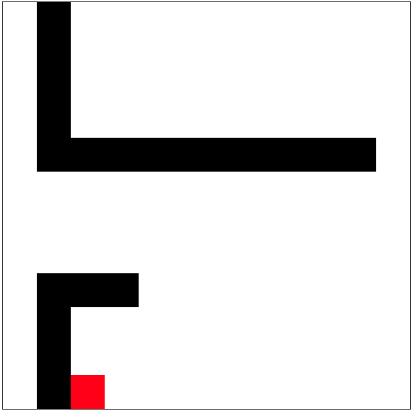
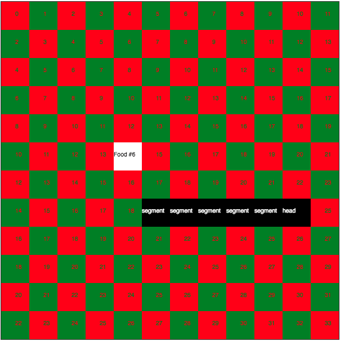

# js-snake

[](https://forthebadge.com) [](https://forthebadge.com)
[](https://forthebadge.com)

---

A very simple Snake game built with `JS(ES6)` on top of `HTML5 <canvas>`.



[](https://jssnake-crush.herokuapp.com/index.html)

Currently there is a more elaborated game created on top of this one, you can check it out at: ["Snake Crush"](https://jssnake-crush.herokuapp.com/index.html)

_OBS: This project is **almost finished** but for now it is still in development._

---

## How to run & Development setup

#### 1 - Clone this repository:

```bash
$ git clone https://github.com/fidelisrafael/js-snake.git 
```

#### 2 - Enter in the directory and install the dependencies:

```bash
$ yarn install # or npm install
```

Currently all dependencies are related to the development/test enviroment, they're:

- [`jest`](https://jestjs.io) for testing.
- [`browserify`](https://github.com/browserify/browserify), [`budo`](https://github.com/mattdesl/budo), [`exorcist`](https://github.com/thlorenz/exorcist) and [`tinify`](https://github.com/browserify/tinyify) for bundling ES6 scripts to Browser


#### 3 - Run the tests to make sure everything is working as expected:

```bash
$ yarn test # or yarn test

# > jest tests/
# Test Suites: 3 passed, 3 total
# Tests:       54 passed, 54 total
```

#### 4 - Build the application

_This application uses [`Browserify`](https://github.com/browserify/browserify) to bundle a valid JS code for Browsers from the ES6 code at `./lib` folder:_

To check if the build is properly working, just run

```bash
$ yarn build && yarn build_dev # or npm run build && npm run build_dev

# > File "public/bundle.js" generated.
# > File "public/bundle.dev.js" generated.
```

If you receive the output above that means that everything is working just as expected, that's great!


#### 5 - Now, you can just run the development server:

_OBS: This will open a new window on your default browser_

```bash
$ yarn dev # or npm run dev
```

OBS: We use [`Budo`](https://github.com/mattdesl/budo) as the development server with live-reload support.

### 6 - Enjoy it :) - And send PR's \o/

---

##  Codebase API:

To run the game through a JS script you can just do as a follow:

```js

// new Game(canvasElement, rows = 12, lines = 12, tileSize = 48, debugMode = false)
const game = new Game('#board', 24, 24)
            
// Start the infinite game loop
game.init()
```

If you want to manage the main game loop by yourself, you'll need to call some functions by hand, example:

```js
const game = new Game('#board')

setInterval(() => {
    console.log("Updating game...")

    // Dispatch the request to redraw things on canvas
    game.update()
}, 500) // updates each 500ms
```

There are many other API functions since this game was created with extensibility in mind, for example you can just redraw the current food at some random position on the map using: `game.spawnRandomFood()`, or finish the game at any point calling: `game.gameOver()`.

This section will be better documented with more examples and more details sooner.

---

### Debug Mode

You can run this application in debug mode to help you to understand what's going on the details. Just pass the `#debug` hash-fragment on URL when you open `index.html` on the browser, eg:

```
http://localhost:9966/#debug
```



As you can see, each fragment of the Snake will have their identification and the same happens with the food as well. The "tiles"(red and green) are the tilesets of the "map/board" where the Snake will be abble to moviment through, and where the food will appear when needed. ß
Note that each tile is basically disposed in a X/Y coordinates in a Coordinate(Cartesian) Plane. For example, the tileset number `3` is on `X = 3 | Y = 0`, the tileset `12` is on `X = 2 | Y = 5`

---


## :calendar: Roadmap <a name="roadmap"></a>

- :white_medium_small_square: Finish writing tests.
- :white_medium_small_square: Add a window(HUD) with the current user points(`snake.length`).
- :white_medium_small_square: Write better documentation for the codebase API.
- :white_medium_small_square: Make a online demo available on Github Pages.
- :white_medium_small_square: Try to render it in different sizes to detected rendering errors.
- :white_medium_small_square: Update this Roadmap with more plans.

---

## :thumbsup: Contributing

Bug reports and pull requests are welcome on GitHub at https://github.com/fidelisrafael/js-snake. This project is intended to be a safe, welcoming space for collaboration, and contributors are expected to adhere to the [Contributor Covenant](contributor-covenant.org) code of conduct.

---

## :memo: License

The project is available as open source under the terms of the [MIT License](http://opensource.org/licenses/MIT).

